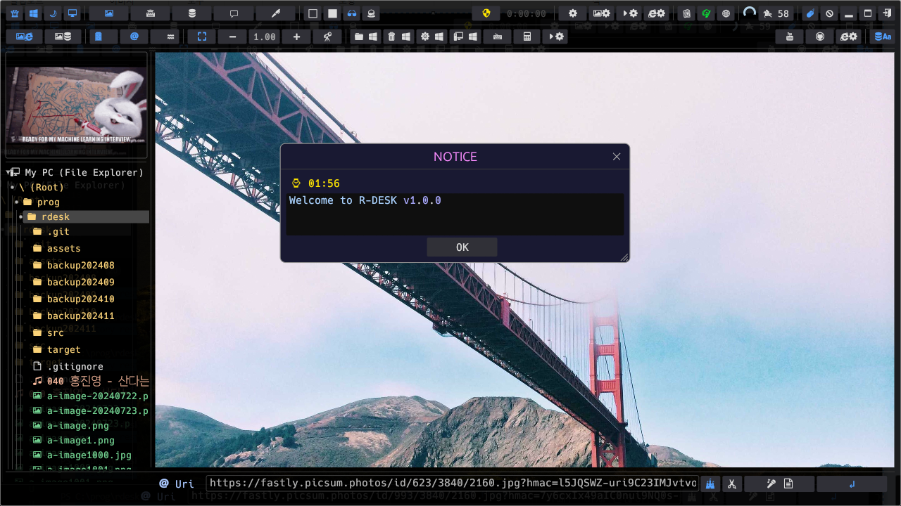
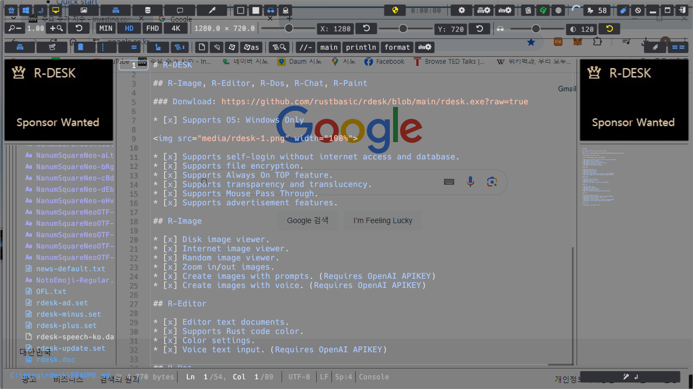
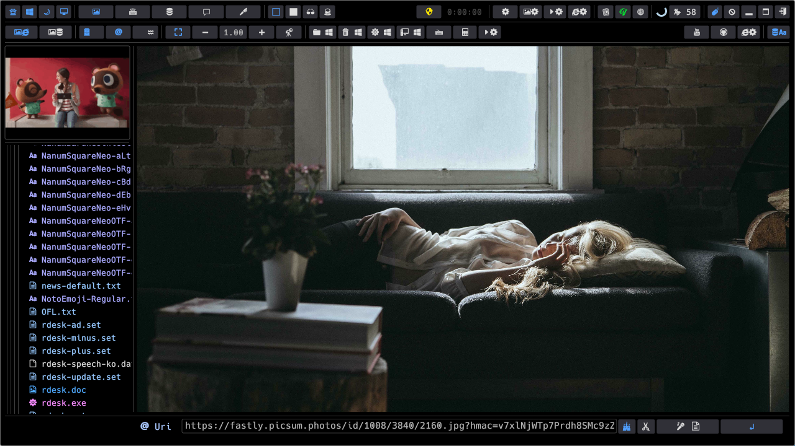
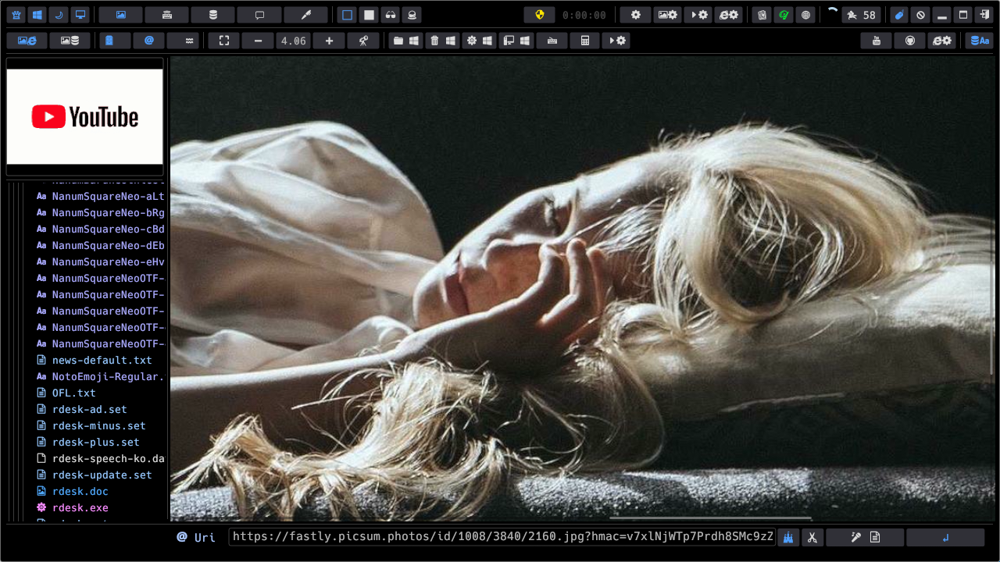
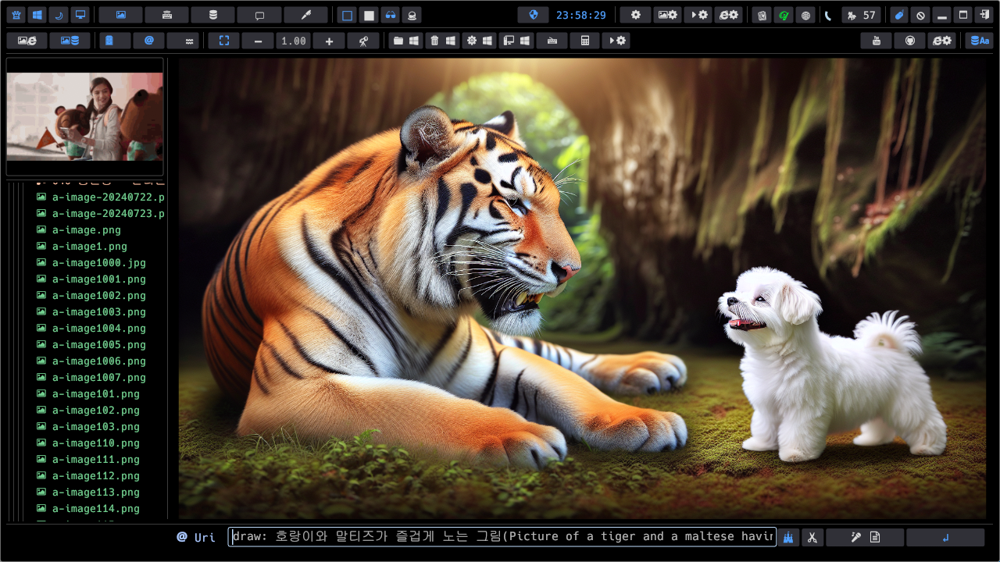

# R-DESK

## R-Image, R-Editor, R-Dos, R-Chat, R-Paint

### Donwload: https://github.com/rustbasic/rdesk/blob/main/rdesk.exe?raw=true

* [x] Supports OS: Windows Only

* [x] Supports self-login without internet access and database.
* [x] Supports file encryption.
* [x] Supports Always On TOP feature.
* [x] Supports transparency and translucency.
* [x] Supports Mouse Pass Through.
* [x] Supports advertisement features.

## R-Image

* [x] Disk image viewer.
* [x] Internet image viewer.
* [x] Random image viewer.
* [x] Zoom in/out images.
* [x] Create images with prompts. (Requires OpenAI APIKEY)
* [x] Create images with voice. (Requires OpenAI APIKEY)

## R-Editor

* [x] Editor text documents.
* [x] Supports Rust code color.
* [x] Color settings.
* [x] Voice text input. (Requires OpenAI APIKEY)

## R-Dos

* [x] View DOS screen.
* [x] Enter DOS commands.
* [x] Display execution history.
* [x] Reuse executed commands.
* [x] Voice command input. (Requires OpenAI APIKEY)

## R-Chat

* [x] Google Gemini supported.
* [x] OpenAI ChatGPT supported. (Requires OpenAI APIKEY)
* [x] Supports waiting room and chat rooms.
* [x] Supports various topics
* [x] Supports voice recognition. (Requires OpenAI APIKEY)
* [x] Supports voice output. (Requires OpenAI APIKEY)

## R-Paint

* [x] Supports transparent board.
